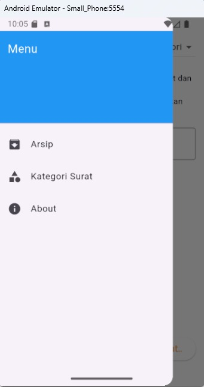
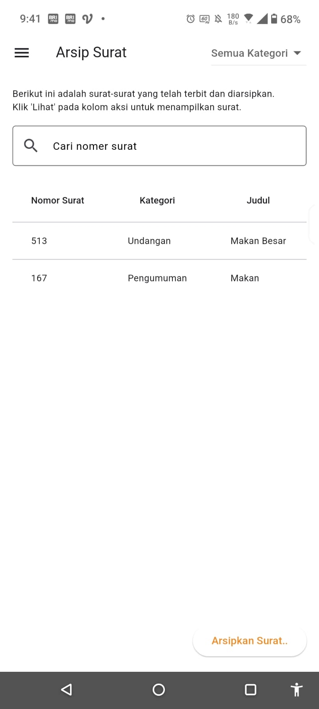
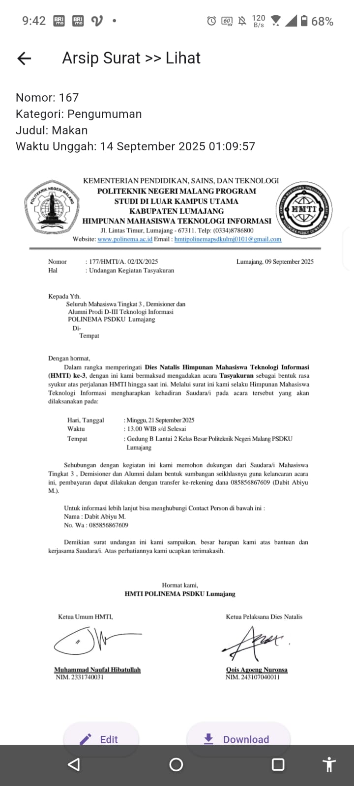
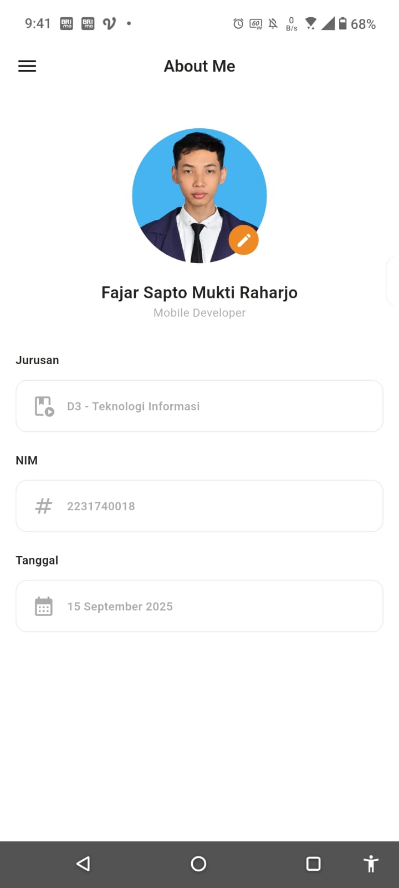

# 📂 Arsip Mobile

Arsip Mobile dikembangkan dengan Flutter + GetX sebagai solusi efisien untuk mengelola arsip digital — memungkinkan pengguna menyimpan, meninjau, mengedit, dan mengunduh dokumen PDF secara praktis melalui perangkat Android.

---

## ✨ Fitur
- 📑 Tambah arsip baru (upload PDF + metadata).  
- 🔍 Kelola arsip berdasarkan kategori.  
- 📝 Edit informasi arsip (nomor surat, judul, kategori, file).  
- 📤 Download arsip ke folder perangkat.  

---

## 🖼️ Tampilan Aplikasi

| Menu Utama | Tambah Arsip | Lihat Arsip |
|-------------|---------------|--------------|
|  |  |  |

| Kategori Surat | Tambah Kategori | CRUD Arsip |
|----------------|------------------|-------------|
|  |  |  |

| Arsip | Lihat Detail | Tentang Aplikasi |
|-------|---------------|------------------|
|  |  |  |

---

## 🚀 Cara Menjalankan

**Link Repositori:**  
[https://github.com/MUHAMMAD-CM/Tugas_Arsip](https://github.com/MUHAMMAD-CM/Tugas_Arsip)

1. Clone repository:
   ```bash
   git clone https://github.com/MUHAMMAD-CM/Tugas_Arsip.git
   cd Tugas_Arsip
   ``"

2. Install dependencies:
   ```bash
   flutter pub get
