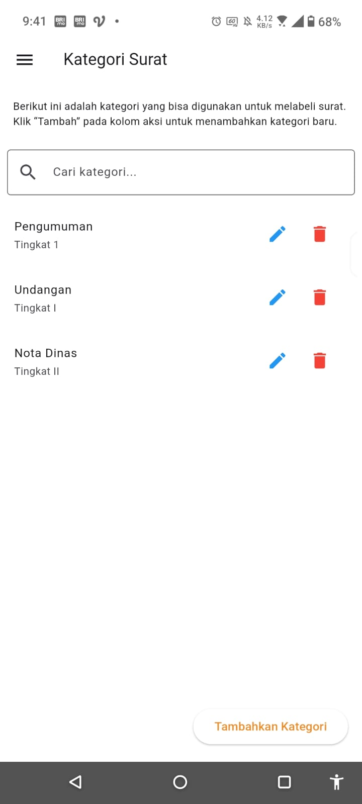
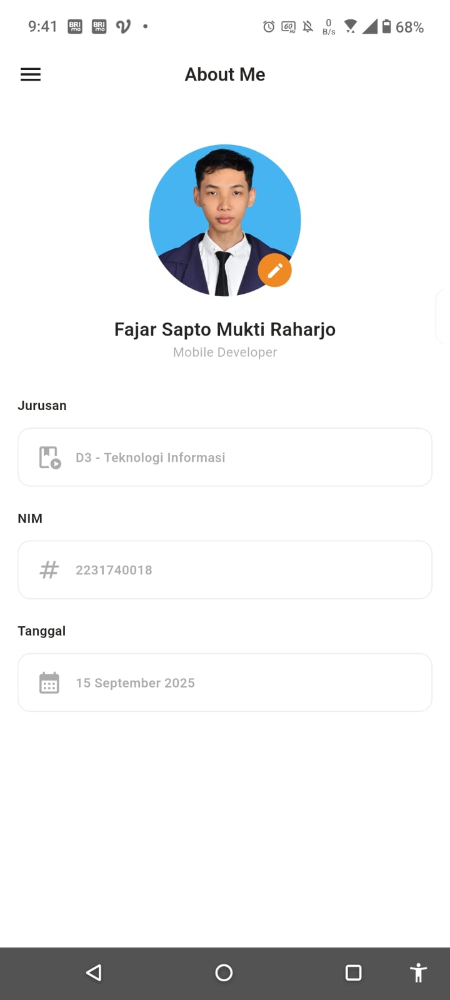

# 📂 Arsip Mobile

Aplikasi **Arsip Mobile** adalah sistem pengelolaan arsip berbasis **Flutter + GetX** yang memungkinkan pengguna untuk menyimpan, melihat, mengedit, dan mengunduh dokumen PDF dengan mudah di perangkat Android.

---

## 🎯 Tujuan
- Mempermudah pengarsipan surat/dokumen digital.  
- Menyediakan akses cepat ke dokumen melalui pencarian dan kategori.  
- Memberikan fitur edit dan unduh arsip secara langsung dari aplikasi.  

---

## ✨ Fitur
- 📑 Tambah arsip baru (upload PDF + metadata).  
- 🔍 Kelola arsip berdasarkan kategori.  
- 📝 Edit informasi arsip (nomor surat, judul, kategori, file).  
- 📤 Unduh arsip ke folder **Download** perangkat.  
- 📖 Viewer PDF bawaan untuk membaca dokumen.  
- ⚡ Snackbar interaktif dengan styling & efek blur.  
- 🎨 UI responsif dengan state management **GetX**.  

---

## 🚀 Cara Menjalankan
1. Clone repository:
   ```bash
   git clone https://github.com/username/arsip-mobile.git
   cd arsip-mobile
   ```

2. Install dependencies:
   ```bash
   flutter pub get
   ```

3. Jalankan aplikasi di emulator/device:
   ```bash
   flutter run
   ```

> ⚠️ Pastikan sudah mengaktifkan permission penyimpanan (storage) di perangkat.

---

## 📸 Screenshot
Tampilan utama aplikasi:

| Home | Detail Arsip | Kategori |
|------|--------------|------------|
|  |  |  |

| About Me |
|------|
|  |

---

## 📌 Teknologi
- [Flutter](https://flutter.dev/)  
- [GetX](https://pub.dev/packages/get)  
- [SQLite](https://pub.dev/packages/sqflite)  
- [flutter_pdfview](https://pub.dev/packages/flutter_pdfview)  
- [permission_handler](https://pub.dev/packages/permission_handler)  

---

## 👨‍💻 Author
Dikembangkan oleh **[Fajar Sapto Mukti Raharjo]** untuk kebutuhan manajemen arsip digital.
